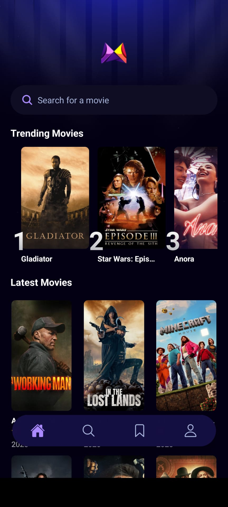
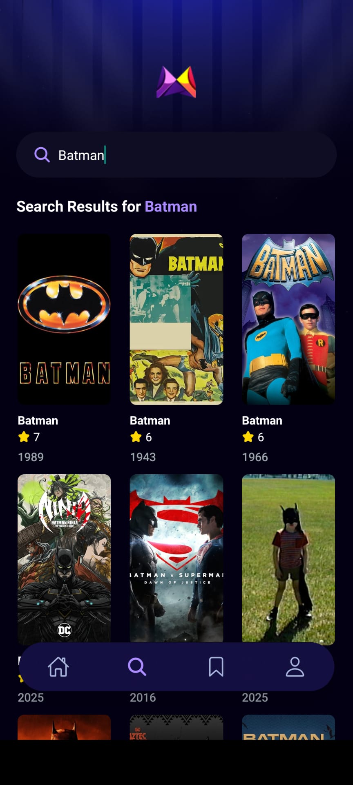
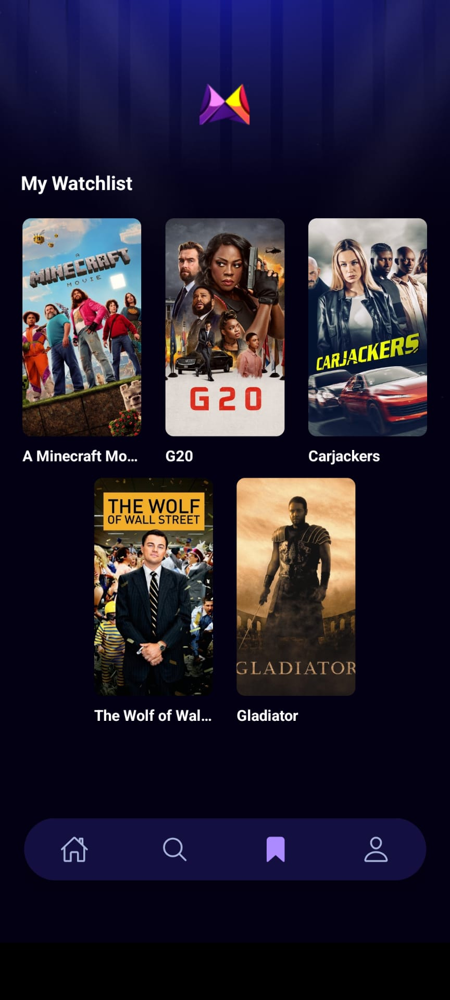
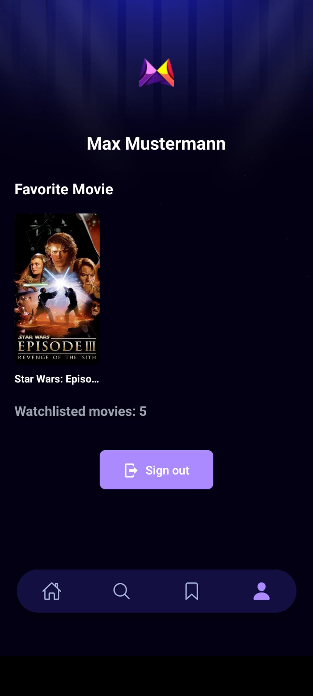
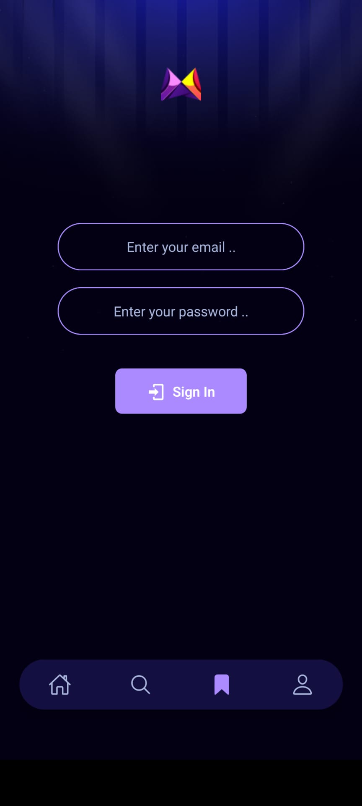

<!-- Improved compatibility of back to top link: See: https://github.com/othneildrew/Best-README-Template/pull/73 -->

<!-- PROJECT LOGO -->
 

<h3 align="center">Movie App</h3>

  

      A simple movie app which can be used to browse new movies and add them to a watchlist.
  

   
   
   
   
   

<!-- ABOUT THE PROJECT -->
## Built With

  
  
  

<!-- DISCLAIMERS -->
## Disclaimer

The majority of this app was created during the following course on React Native: [JavaScript Mastery - React Native for Beginners in 2025](https://youtu.be/f8Z9JyB2EIE?si=o74Du2DS1VQF0v5W).
The watchlist feature and the authentification with Appwrite was implemented by myself.
